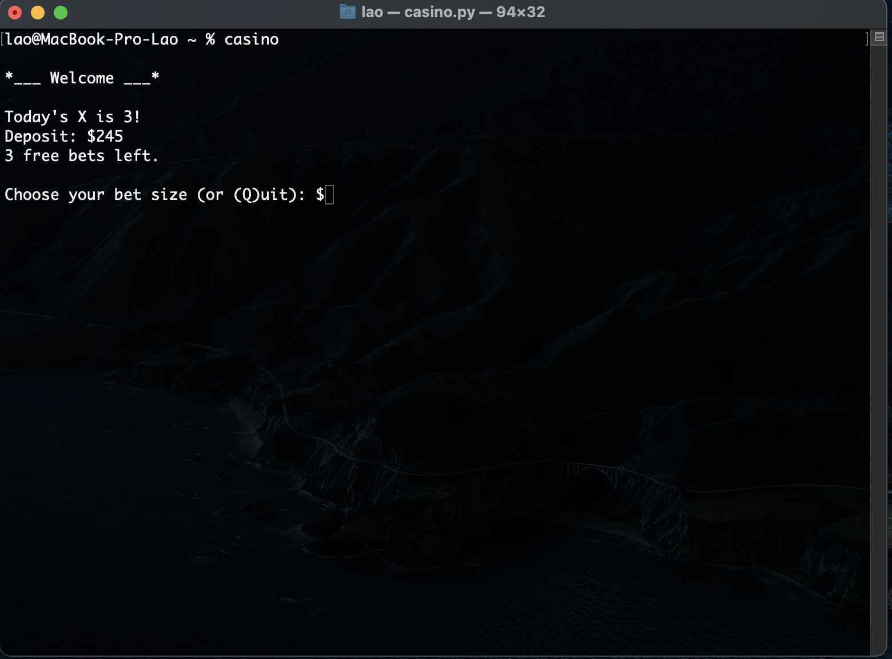
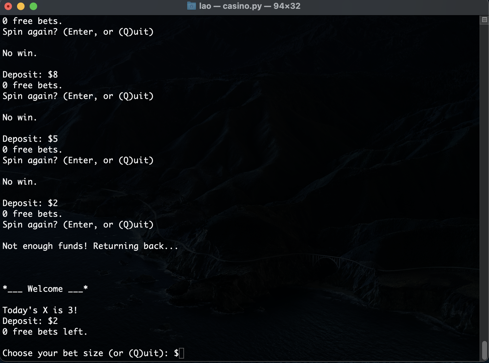
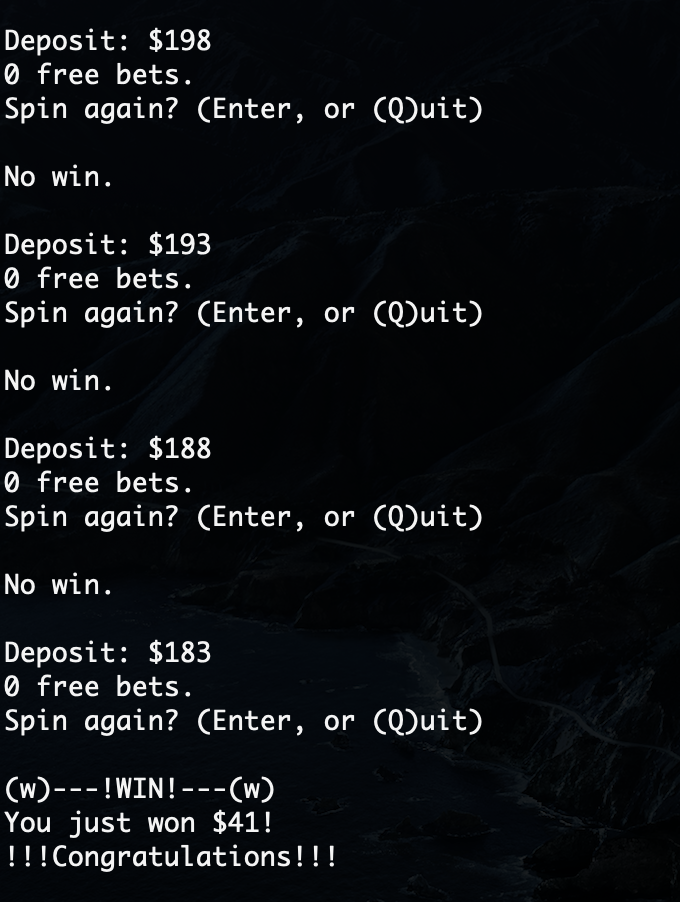

<h1 align="center">
    Pocket Casino
</h1>
<p align="center">
    Welcome to my first project since 2023! Was a bit tired of coding so I took a break and focused on my studies instead.</br>
    "Pocket Casino" is a simple real-life casino simulator for your terminal. I wrote it when I was bored without internet during my trip lol)</br>
    <h3>Disclaimer!</h3>This game doesn't involve the use of real money. All "gambling" process is virtual and you're not supposed to change it except the virtual game parameters such as start-up funds and chance of winning.
</p>

* [Installation](#installation)
* [Configuring game parameters](#configuring-game-parameters)
* [Game screenshots](#screenshots)

## How it works
##### After installing, open your command line and enter this `casino` to start the game.</br>I've added some virtual "funds" to your account by default so you don't need to configure anything if you are satisfied with my default parameters, but if you want, you can proceed to [Configuring game parameters](#configuring-game-parameters) section.</br>Then you just choose your bet size and hit Enter to spin and test your luck.</br>You can hit either standard or big win, free bets, or jackpot. Your win size partially depend on your bet size and general win multiplier too *(note that given multipliers won't work when you win something during the free bet)*.</br>Good luck!

## Installation 
### (macOS/Linux, Windows guide coming soon):
#### 1. Clone this repo to your user `~/` folder
#### 2. In the same directory, add this to your run control script (usually `.bashrc` or `.zshrc`):
```
alias casino="python3 ~/Pocket-Casino/casino.py"
```
#### Now you're all set and you just need to re-open your terminal if it was active during the installation process.

## Configuring game parameters
### Changing your initial deposit and amount of free bets:
##### [wallet.csv](https://github.com/codelao/Pocket-Casino/blob/main/wallet.csv) contains two values on second line: first - your deposit, second - free bets. You can change this parameters either in a text editor or in specialized programs like Microsoft Excel.
### Changing general win multiplier and win chances:
##### [casino.py](https://github.com/codelao/Pocket-Casino/blob/main/casino.py) is a main game script where on lines *14, 20, 21, 22, 23* you can set your own win chances and multipliers (hints are provided inside the script).


## Screenshots
 </br>

